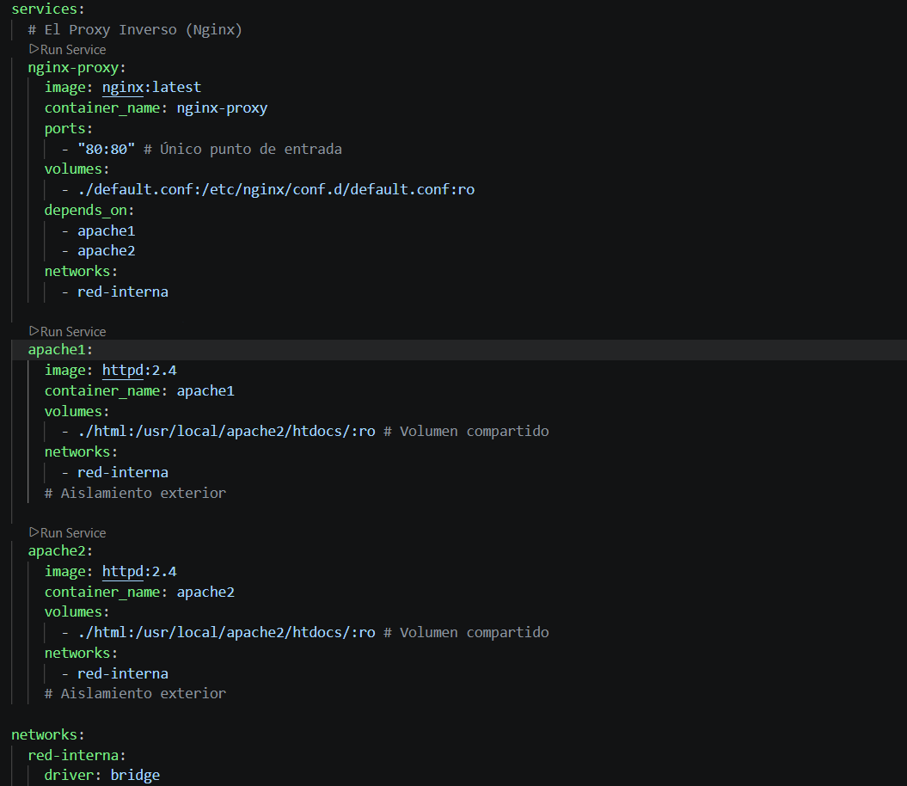
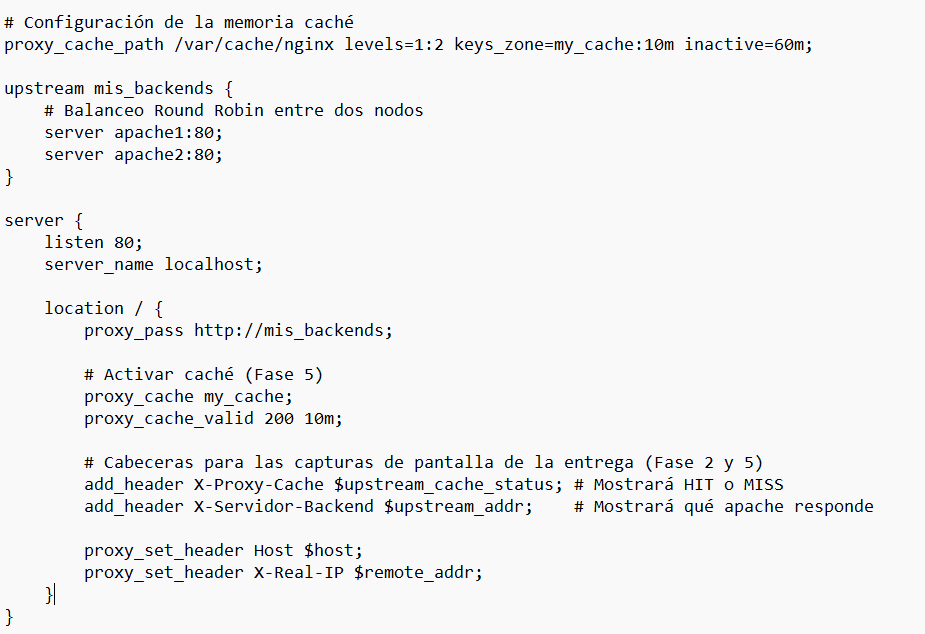
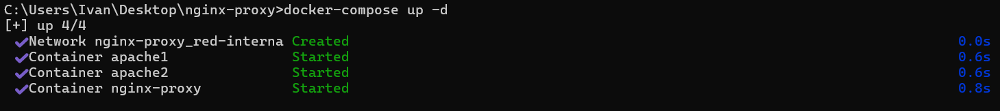
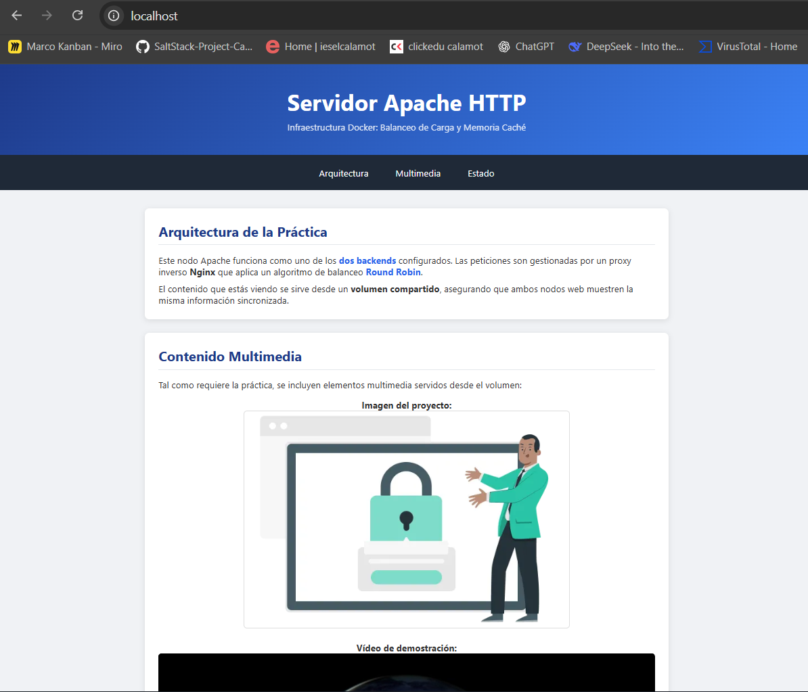
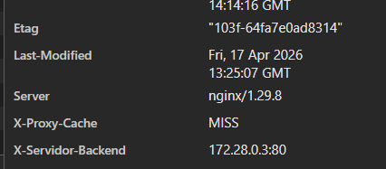
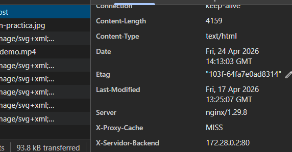
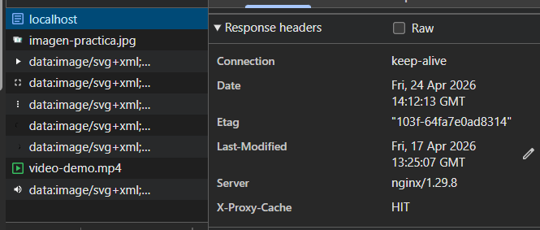
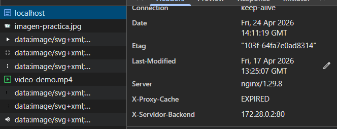
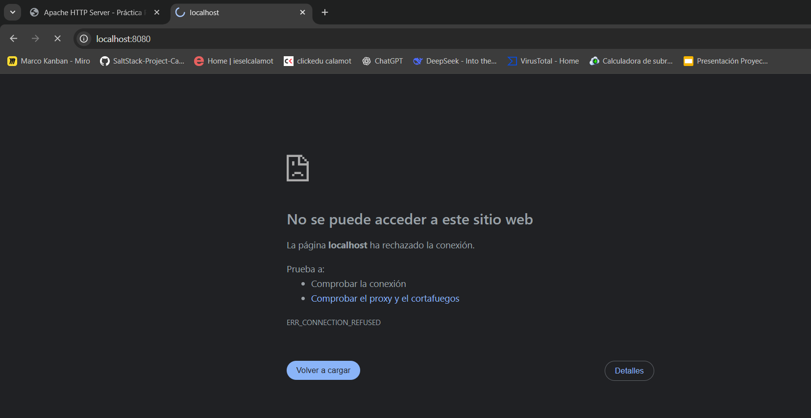

1. Arquitectura del Sistema
La solución se compone de tres nodos principales dentro de una red virtual aislada:

Punto de Entrada (Nginx): Actúa como proxy inverso y balanceador de carga. Es el único componente expuesto al exterior (Puerto 80).

Backends (Apache x2): Dos servidores httpd que sirven el contenido estático de forma redundante.

Red Interna: Una red tipo bridge que aísla los servidores Apache del acceso directo desde el host.

Volumen Compartido: Una carpeta local ./html vinculada a ambos backends para garantizar la consistencia del contenido.

      FLUJO DE LA INFRAESTRUCTURA
      =============================

          USUARIO (Navegador)
                 |
          [ Puerto: 80 ]  <-- Único acceso
                 |
        +------------------+
        |  NGINX (Proxy)   | <-- Balanceador
        +------------------+
           /            \
    (Red Interna)    (Red Interna)
         /                \
  +-----------+      +-----------+
  | APACHE 1  |      | APACHE 2  |
  +-----------+      +-----------+
         \                /
          \______________/
                 |
        [ Carpeta ./html ] <-- Volumen compartido

2. Requisitos Previos
Docker Desktop instalado y en funcionamiento.

Docker Compose.

Carpeta del proyecto con la siguiente estructura:

/nginx-proxy
├── docker-compose.yml       # Orquestador de servicios
├── default.conf             # Configuración de balanceo y caché
└── /html                    # Carpeta compartida (Volumen)
    ├── index.html           # Página principal
    ├── imagen-practica.jpg  # Recursos multimedia
    └── video-demo.mp4       # Recursos multimedia

3. Configuración de los Ficheros
3.1. Docker Compose
El archivo docker-compose.yml define la orquestación de los servicios, la red red-interna y los volúmenes compartidos.

3.2. Configuración del Proxy (Nginx)
El fichero default.conf establece las reglas de balanceo Round Robin, la zona de memoria para la caché y la inserción de cabeceras personalizadas para la auditoría de peticiones.

4. Despliegue
Para levantar la infraestructura, se debe ejecutar el siguiente comando en la terminal desde la raíz del proyecto:

docker-compose up -d

Verificación del despliegue:
Ejecuta docker ps para confirmar que los tres contenedores están en estado Up.

5. Demostración y Verificación
5.1. Acceso Único y Contenido

Al acceder a http://localhost, el proxy inverso sirve el contenido almacenado en el volumen compartido.

5.2. Balanceo de Carga (Fase 2)
Gracias a la cabecera X-Servidor-Backend, podemos verificar qué nodo de Apache está respondiendo. Al refrescar la página, se observa la alternancia de IPs internas.

IP DISTINTA (el otro)

5.3. Gestión de Caché (Fase 5)
Nginx gestiona una caché local para mejorar la latencia. La cabecera X-Proxy-Cache muestra el estado:

MISS: La petición fue enviada al backend.

HIT: La petición se sirvió desde la caché de Nginx.

EXPIRED: Aparece cuando el contenido en caché ha superado el tiempo de validez definido (proxy_cache_valid), obligando a Nginx a verificar si hay una versión nueva en el backend.

5.4. Aislamiento de Red
Se comprueba que los servidores Apache no son accesibles directamente mediante sus puertos nativos o mapeos externos, garantizando que todo el tráfico pase obligatoriamente por el proxy.

6. Comandos Útiles de Mantenimiento
Ver logs en tiempo real: docker-compose logs -f

Detener servicios: docker-compose stop

Eliminar contenedores y red: docker-compose down
